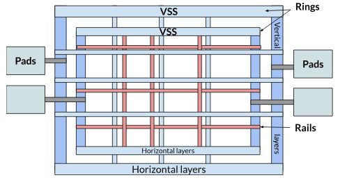

# Floorplanning

Floorplanning is the process of defining the physical organization of a chip before detailed placement and routing.  
It sets the foundation for power distribution, signal flow, and overall chip performance.

### Core Floorplan Components

- Establishes the **chip outline** and core area.  
- Defines the position of **I/O pads, macros, and memory blocks**.  
- Ensures a robust **power delivery network (PDN)**.  
- Affects performance, congestion, and manufacturability.  

## Main Floorplan Elements

### Chip geometry and sizes

1. **Core** — main active area where logic or analog circuitry is placed.  
2. **Die boundary** — outer limit of the silicon area.  
3. **Power ring** — metal ring providing VDD/VSS around the core.  
4. **Pad/IO cells** — interface cells for input/output signals.  
5. **Corner and filler cells** — maintain pad ring continuity and geometry.  
6. **Bond cells** — connect the chip to the package.  


```{seealso}
```

### Padring

The padring defines the peripheral region of the chip that connects internal circuitry to the outside world.
It ensures proper I/O routing, ESD protection, and mechanical continuity around the die.

- IO pad cells — provide electrical connection between the core and package pins.
- Power and ground pads — distribute supply and reference voltages to the core.
- Corner cells — close the padring at die corners and route power rings.
- Filler cells — maintain uniform spacing and metal continuity between pads.
- ESD structures — protect I/O pads from electrostatic discharge.

### Macro placement

Macro placement defines how large functional blocks (e.g., SRAMs, PLLs, analog IPs) are positioned within the core area.
Proper placement minimizes routing congestion, reduces timing delays, and simplifies power delivery.

- Abutted placement — macros are placed edge-to-edge to save area and simplify routing between them.
- Non-abutted placement — spacing (channels) is left between macros for routing or isolation.
- Channel space — reserved gap between macros for signal and power routing.
- Criss-cross routing — undesired long-distance interconnections that increase delay and congestion.
- Notches — irregular gaps between macros that can cause local congestion; should be avoided.
- Round-about routing paths — occur when macros block direct connections; optimize placement to minimize these.


### Power Grid

The power grid (or Power Distribution Network, PDN) delivers stable supply and ground voltages across the entire chip.
A well-structured PDN minimizes IR drop, electromigration, and noise coupling between blocks.

- Power rings — thick metal loops surrounding the core, distributing VDD and VSS from the pads.
- Power rails — horizontal and vertical metal lines that deliver power inside the core region.
- Straps — wider interconnects connecting local rails to higher metal layers or rings.
- Pads — provide external access to the power network.
- Layer orientation — alternating horizontal and vertical metals improve coverage and reduce resistance.



## Floorplanning in digital design

- **Inputs**:  
  - Gate-level netlist.  
  - Library files (standard cells, LEF).  
  - Timing and power constraints.  

- **Process**:  
  - Define die/core dimensions.  
  - Place I/O pins and macros (SRAMs, PLLs, etc.).  
  - Insert power rings and initial PDN.  
  - Reserve routing channels and keep-out zones.  

- **Outputs**:  
  - Floorplan DEF/LEF files.  
  - Reports for area utilization and congestion estimates.  

```{seealso}
**Video Series – Floorplanning Basics (VSD YouTube)**  
- [Part 1](https://www.youtube.com/watch?v=Z1Cxbn5LOYg)  
- [Part 2](https://www.youtube.com/watch?v=iKGxOVbwi40)  
- [Part 3](https://www.youtube.com/watch?v=YcwY1PH31qg)  
- [Part 4](https://www.youtube.com/watch?v=AW6OwZxY7VY)  
- [Part 5](https://www.youtube.com/watch?v=IG0EWRcDkl8)  
- [Part 6](https://www.youtube.com/watch?v=3n_v_1HRlzM)  
- [Part 7](https://www.youtube.com/watch?v=HVeSgMS8-SU) 

For detailed steps on digital floorplanning, see:  
- {doc}`../digital_flow/librelane/steps/floorplaning`  
- {doc}`../digital_flow/OpenROAD-Flow-Script/steps/floorplaning`
```

## Floorplanning in analog design

- **Focus**: transistor arrays, current mirrors, matched pairs.  
- **Process**:  
  - Define symmetry and common-centroid structures.  
  - Reserve guard rings and isolation wells.  
  - Plan routing paths for sensitive nodes.  

- **Outputs**:  
  - Schematic-driven layout templates.  
  - Analog floorplan sketches (often manual).  

```{seealso}
For schematic-driven analog layout, see:  
- {doc}`../analog_flow/steps/floorplaning`  
```

## Mixed-signal considerations

- Separation of digital and analog domains to reduce noise coupling.  
- Dedicated power grids for analog and digital blocks.  
- Shielding of sensitive analog traces from switching digital nets.  

```{seealso}
For mixed-signal integration, see:  
```

## Further Reading

- 1001
- 1002
- 1006
- 1007
- 1017
- 1018