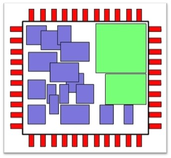

# Placement

**Placement** is the step where the components of a circuit (standard cells in digital, or devices in analog) are arranged within the chip area.  
A good placement ensures efficient routing, minimizes delay, and improves overall performance.

### Why placement matters

- Directly affects timing, power, area, and routability.
- Influences routing congestion and manufacturability.
- For analog, placement is critical for matching, symmetry, and noise isolation.

## Placement in digital design

- **Inputs**:  
  - Floorplan (die/core dimensions, macros, IO positions).  
  - Gate-level netlist.  
  - Timing and congestion constraints.  

- **Process**:  
  - Standard cells are placed and legalized on predefined rows.
  - Placement is optimized for wire length, delay, and congestion.
  - Optional re-placement occurs after CTS or optimization.
  - Density, utilization, and congestion are estimated to guide refinement.

- **Outputs**:  
  - Placed DEF file.  
  - Reports for wire length, congestion, and timing impact.  

### Global, Legalization, and Detailed placement

Placement is performed in multiple stages to gradually refine the position of all standard cells while ensuring design rules and timing are met.

- Global placement — generates an initial, coarse arrangement of cells to minimize total wire length and balance congestion.
  - Cells may overlap at this stage.
  - Uses analytical or force-directed algorithms.
  - Provides a rough density and timing estimation.



- Legalization — adjusts the preliminary positions to align cells to valid rows, remove overlaps, and respect placement blockages.
  - Maintains minimal displacement from global placement results.
  - Ensures cell orientation and row conformity.
  - Creates a layout ready for detailed placement.

- Detailed placement — performs fine adjustments to further optimize local wire length, timing, and routability.
  - Includes cell swaps, shifts, and local reordering.
  - May be repeated after CTS or optimization stages.


```{seealso}
For practical details, see:
- {doc}`../digital_flows/openroad/flow_steps`  
- {doc}`../digital_flows/librelane/flow_steps`  

**Video Resource – Placement Basics (VSD YouTube)**  
[Placement Fundamentals](https://www.youtube.com/watch?v=hVT8pRgr5zg)
```

## Placement in analog design

- **Focus**:  
  - Device matching (current mirrors, differential pairs).  
  - Symmetry and common-centroid layouts.  
  - Minimizing parasitics and coupling.  

- **Process**:  
  - Manual arrangement of devices based on schematic intent.
  - Placement is schematic-driven or constraint-assisted.
  - Use of guard rings, dummy devices, and shielding.

- **Outputs**:  
  - Layout drafts with critical device placement.  
  - Guidelines for later routing.  

```{seealso}
For examples of schematic-driven analog layout, see:
- {doc}`../analog_flows/magic_layout`
```

## Mixed-signal considerations

- Isolation between noisy digital blocks and sensitive analog sections.  
- Placement of decoupling capacitors and power domains.  
- Ensuring short interconnects for analog critical paths.  

```{seealso}
See {doc}`../mixed_signal/analog_on_top` for integration guidelines.
```

## Further Reading