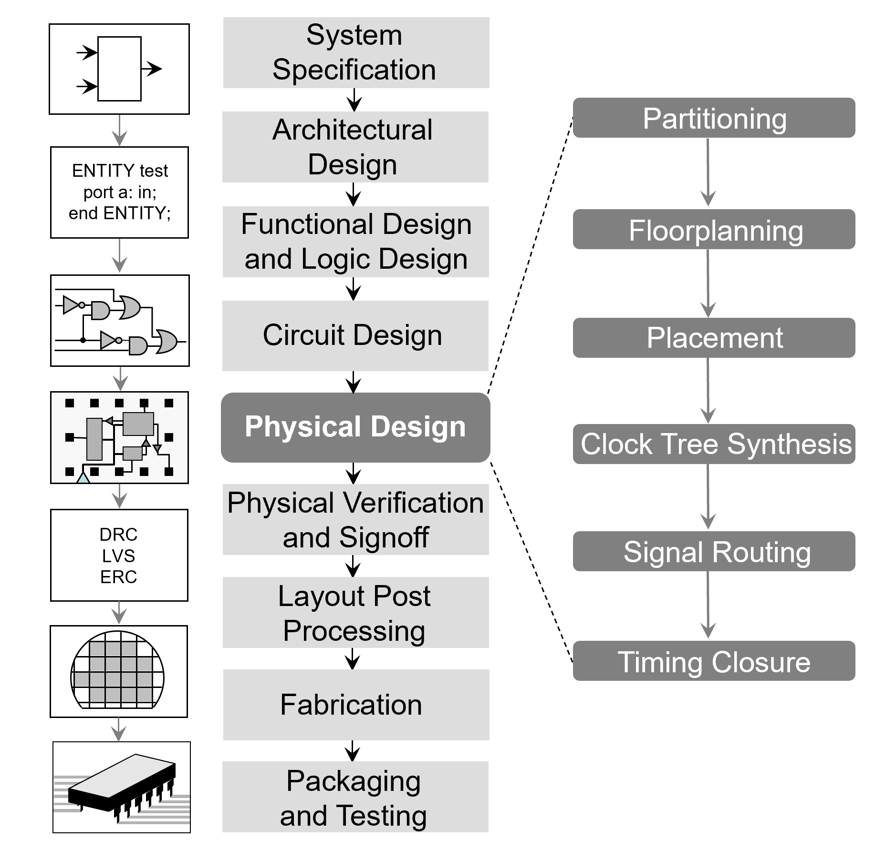

# Digital Flow

The digital flow describes the complete process of transforming a hardware description (usually written in Verilog or VHDL) into a manufacturable physical layout (GDSII). It connects the abstract, logical design world with the physical constraints of a real chip.

## Overview of the Digital Design Flow

A typical RTL-to-GDSII process involves several key stages, each with specific objectives, inputs, and outputs.

| Stage | Description | Key Outputs |
|:--|:--|:--|
| **1. RTL Design** | Create the digital system using a hardware description language (HDL) such as Verilog or VHDL. | RTL source files |
| **2. [Simulation](../concepts/simulation) and Verification** | Functionally verify that the RTL behaves as intended using testbenches and waveforms. | Simulation reports, VCD waveforms |
| **3. [Synthesis](../concepts/synthesis)** | Convert RTL into a gate-level netlist mapped to a standard-cell library. | Gate-level netlist (`.v`), synthesis reports |
| **4. [Floorplanning](../concepts/floorplaning)** | Define the chip’s outline, power grid, and macro placement. | Floorplan DEF, power distribution network (PDN) |
| **5. [Placement](../concepts/palcement)** | Place standard cells according to timing and congestion constraints. | Placed DEF |
| **6. Clock Tree Synthesis (CTS)** | Insert clock buffers and balance skew across the design. | Clock tree netlist and report |
| **7. [Routing](../concepts/routing)** | Connect all signals using metal layers while minimizing parasitics and congestion. | Routed DEF, timing reports |
| **8. [Parasitic Extraction](../concepts/parasitic_extraction)** | Extract RC parasitics to model real interconnect delays. | SPEF or extracted netlist |
| **9. "Physical Verification and Sign-off** | Check design rules (DRC), logical equivalence (LVS), and timing (STA). | DRC/LVS reports, timing analysis |
| **10. [GDS Export](../concepts/gds_export)** | Generate the final GDSII layout for tape-out. | GDSII file |

## Tool-Independent Concept

Each stage can be implemented using different open-source tools, but the overall flow remains the same. This section focuses on the concepts and dependencies between stages, while the following pages describe tool-specific implementations.

- For OpenROAD Flow Scripts: see [OpenROAD Flow Script](OpenROAD-Flow-Script/index)
- For LibreLane: see [Librelane Flow](librelane/index)

## Design Artifacts

Throughout the flow, several artifacts are produced and reused between stages:

| Artifact | Produced by | Consumed by |
|:--|:--|:--|
| RTL (`.v`, `.sv`) | Designer | Synthesis, Simulation |
| Constraints (`.sdc`) | Designer | Synthesis, STA |
| Gate-level netlist | Synthesis | Floorplanning, Placement |
| DEF/LEF | Physical design | Routing, Verification |
| SPEF | Extraction | STA |
| GDSII | Export | Tape-out |

## Common Open-Source Tools per Stage

| Stage | Typical Tools |
|:--|:--|
| Simulation | Verilator, Icarus Verilog, GTKWave |
| Synthesis | [Yosys](../tools/yosys) |
| Floorplanning / Placement / Routing | [OpenROAD](../tools/openroad/index) |
| Verification (DRC/LVS) | [Magic](../tools/magic), [KLayout](../tools/klayout), Netgen |
| Extraction / STA | OpenRCX, OpenSTA |
| GDS Export | [Magic](../tools/magic), [KLayout](../tools/klayout) |

>  *The following subsections describe how each open-source flow (OpenROAD-Flow-Scripts, LibreLane, etc.) executes these same stages automatically or manually.*

