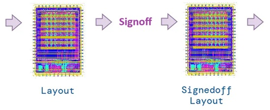
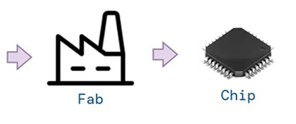
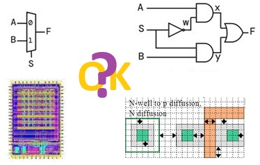
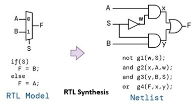
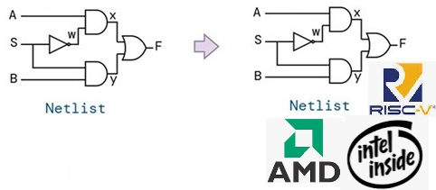
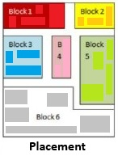
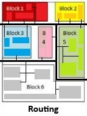
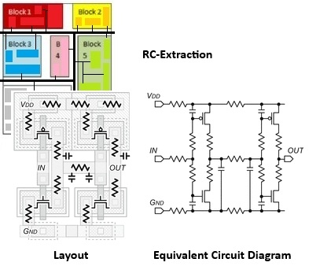
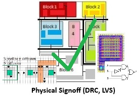

# Introduction to Open Source Chip Design

## Basics of Digital Circuits and Chip Design

**ICs and their production** 

**ICs (Integrated Circuits, "semiconductor chips")** consist of millions of field effect transistors (FETs) and other electronic components (resistances, capacities) that process information and perform various functions in electronic devices, such as computers.

The corresponding processes are called:

* SSI: Small Scale Integration (FETs/IC < 100 )
* MSI: Medium Scale Integration (100 < FETs/IC < 1K)
* LSI: Large Scale Integration (1K < FETs/IC < 10K>)
* *VLSI: Very-Large Scale Integration (10K < FETs/IC < 100K)*
* ULSI: Ultra-Large Scale Integration (100K < FETs/IC < 10M)
* SLSI: Super-Large Scale Integration (10M < FETs/IC)

## Fundamentals to ASIC design workflows

**ASICs and design workflows**

In contrast to *general-purpose chips* such as microprocessors, which can be used for a wide variety of tasks, **ASICs (application-specific integrated circuits)** are specifically designed for a specific purpose, such as smartphones, cars, and medical devices.

The chip design process may be *optimized in terms of content and time* by using a proven **ASIC design workflow** (e.g. Librelane), with *each phase supported by powerful EDA (Electronic Design Automation) tools*.

A characteristc output of an ASIC design flow is a **GDSII-File**, which allows the produktion of a *set of photolithographic masks*. These enable the *production of ASICs, based on normativ process steps within a semiconductor fab*.

## Fundamentals to ASIC design workflows

**Fundamental phases of ASIC design workflows - Frontend**

- **Design Entry:** Initially, the logic *circuit design is created* using a *hardware description language (HDL)*, e.g., System Verilog, iVerilog, or Verilator, *based on a circuit description*, e.g., the behavioral level, data flow level, or register transfer level.

## Fundamentals to ASIC design workflows

Hardware Description Languages (HDL):

| HDL | Name | Application |
|---|---|---|
| Verilog | Verification Logic | For the design of digital circuits |
| Verilog-AMS | " | Extension for Verilog to support analog and mixed-signal systems |
| SystemVerilog | " | For the design and verification of digital circuits, at a higher level of abstraction than Verilog |

## Fundamentals to ASIC design workflows

| HDL | Name | Application |
|---|---|---|
| VHDL | VHSIC Hardware Description Language | Standardized language for design and simulation of digital systems |
| VHDL-AMS | " | Extension for VHDL to support analog and mixed-signal systems |
| SystemC | System C | C++ tool for system design, including hardware development |

## Fundamentals to ASIC design workflows

- **_Functional Verification:_** It is important to identify design errors early on. Therefore, the hardware description of the circuit, e.g., in Verilog, must be promptly verified against the circuit requirements. This is done through *simulation or formal methods*, using both the previously generated *circuit descriptions at Register Transfer Level (RTL)* and the *netlists generated in the following steps*.
- **RTL Synthesis:** In this step, the *HDL description of the logic circuit*, at Register Transfer Level (RTL), i.e., the \*.v file, is converted into a circuit consisting of logic cells, the so-called *netlist*.

## Fundamentals to ASIC design workflows

## Fundamentals to ASIC design workflows

**Fundamental phases of ASIC design workflows - Backend**

- **Layout Synthesis:** During the physical implementation, *the netlist*, i.e., the circuitry consisting of logic cells, *is converted into a layout (set of photomasks)* for the ASIC production. \
This complex step comprises *several substeps* that are typically automated using a workflow. These include e.g.: floorplanning, placement, clock tree synthesis, and routing. \
Because placement and routing are the most time-consuming processes, these steps are sometimes referred to collectively as "placement and routing," or PnR.

## Fundamentals to ASIC design workflows

## Fundamentals to ASIC design workflows

- **_Signoff / Verification:_** The signoff process *ensures that the ASIC functions properly, operates efficiently*, and ultimately delivers what it promises, before the chip design is released for chip manufacturing.

## Fundamentals to ASIC design workflows

Please note that these five phases are essential, overarching phases - there are numerous other phases that are assigned to these or are applied systematically throughout the flow, as shown within the next pages.

# Frontend Chip Design Phases

## Frontend Chip Design Phases

## Design Entry

**Definition of the Design Entry Stage**

Design Entry is the initial phase where the functional requirements of a chip are transferred into a detailed, high-level design, typically using Hardware Description Languages (HDLs) such as Verilog or VHDL to describe the chip's logic and architecture at the Register Transfer Level (RTL).

- Defining Functionality: The chip's intended behavior, features, and specifications are defined and coded into a formal language.
- Hardware Description Languages (HDLs): HDLs like Verilog or VHDL are used to describe the chip's logic and the flow of data between registers.
- Register Transfer Level (RTL): The design is described at the RTL, which focuses on how data moves through the chip's registers and combinational logic.
- Position within the Chipdesign-Flow: Design Entry is the initial phase.

## Design Entry

**Input**

- Requirement Specification: A detailed document outlining the functional and performance requirements of the chip.
- Micro-Architecture Document: A document that details the design's internal structure, components, and how they interact.
- Intellectual Property (IP): Reusable blocks of design, such as processors or specialized memory interfaces, that are developed or purchased and integrated into the overall design.

**Output**

- RTL Code: The primary output of this stage, which contains the functional description of the chip.
- Simulatable Models: The RTL code is used to create models for simulation, allowing engineers to test the design's behavior before physical implementation.

## RTL Synthesis: RTL Linting

**Definition of RTL Linting**

RTL linting in chip design is a static RTL code analysis of hardware description languages ​​such as Verilog or VHDL. Using special tools, potential design errors, architectural weaknesses, synthesis problems, and violations of coding guidelines are identified early on. This improves code quality, avoids costly errors in later design phases, and ensures that the design is stable, performant, and reusable.

Static Analysis: RTL linting uses linter tools to analyze the RTL source code without executing it.

- Rule-based code review: Specialized linting tools review and improve code based on predefined rules to ensure that the code complies with coding guidelines, promoting readability and reusability.
- This makes it a fundamental step in ensuring the robustness, i.e., functionality, performance, and reliability of the design.

## RTL Synthesis: RTL Linting

Early design error detection: Linting finds errors (e.g., design flaws, synthesis-related errors, unwanted latches, incompatible bus widths, multi-drive ports, incorrect reset logic, false use of clock signals, or style and readability issues) that even simulation might not detect.

- Linting thus reduces costs and time by avoiding expensive rework and extended verification cycles in complex chip design processes - thus increasing efficiency.

Position in the chip design flow: RTL linting is a critical step that helps developers correct RTL code and ensure the quality and functionality of the design.

- It should be performed as early as possible (before simulation and the actual synthesis processes) in the design flow (ideally immediately after RTL code generation) and
- can be applied repeatedly if necessary to ensure consistency after each revision.

## RTL Synthesis: RTL Linting

**Input**

- Hardware Description Language (HDL) code: The primary input is the RTL code written in languages like Verilog or VHDL, which describes the circuit's behavior.
- Design constraints: Files such as SDC (Synopsys Design Constraints) or XDC (Xilinx Design Constraints) provide information on timing and other design parameters.
- Vendor-specific primitives: For specific hardware like FPGAs, the linter needs to understand custom primitives, which are direct instantiations of logic elements, clocking resources, and I/O cells.
- IP blocks: Modern designs include pre-designed IP blocks, which are also analyzed to ensure compatibility and proper integration.

## RTL Synthesis: RTL Linting

**Output**

- Linting report: The report is a detailed summary of a static code analysis, applied to the RTL code (Verilog, VHDL, etc.), resulting in a detailed list of violations of coding rules and potential design issues (e.g. multi-driven ports, latch detection),
- Error and warning flags: The linter identifies specific errors (e.g. potential bit overflows in arithmetic operations), and flags them for the designer, with:
  - The location in the code (line number, module), and
  - A description of the problem.
- Code quality metrics: It provides metrics that help assess code readability and robustness, contributing to a higher-quality, more maintainable codebase - occasionally corrected RTL code.

## RTL Synthesis: RTL Synthesis

**Definition of RTL Synthesis**

RTL Synthesis: RTL synthesis in chip design converts register-transfer-level (RTL) code written in hardware description languages ​​(HDLs) such as Verilog or VHDL into a network-list-based representation of logic gates and gate-level connections. The following prerequisites are required:

- RTL Code: The RTL code describes the behavior and data flows of the design.
- Technology Library: The technology-specific library contains information on logic gates, memory, and other components required for production.
- Constraints: Specifications for performance, power consumption, and physical size (area) are provided to the synthesis tool as design constraints.

## RTL Synthesis: RTL Synthesis

**The RTL Synthesis Process**

The conversion of the RTL code into a network list takes place in several steps:

- Code Parsing: The synthesis tool analyzes the RTL code.
- Logic translation: The RTL code is converted into a netlist consisting of simple logic gates, memory, and interconnects.
- Optimization: During synthesis, the design's performance, power, and area requirements are optimized.
- Netlist generation: The result is a gate-level netlist that serves as the basis for subsequent steps in chip design.

## RTL Synthesis: RTL Synthesis

**Importance of RTL Synthesis**

Significance of RTL synthesis for chip design:

- Automation: It automates the complex creation of the gate-level representation.
- Hardware implementation: It bridges the gap between an abstract description of the design and the actual hardware-based implementation.
- Optimization: It enables the design to be optimized to the required performance, power, and area targets.

Position in the design flow: RTL synthesis is a core step in the development of integrated circuits (ICs) to translate a functional design into a hardware-implementable form and to optimize it for areas such as performance, power consumption and area.

## RTL Synthesis: RTL Synthesis

**Input**

- RTL Code: The RTL code (code generated with HDL (Verilog or VHDL)) describes the behavior and data flows of the design.
- Technology Library: The technology-specific library contains information about
  - the specific logic components (gates, flip-flops, memory elements, and other components) and
  - their properties (performance, timing, area) available for production in a particular chip technology.
- Design Constraints: Specifications for performance, power consumption, timing, and area are provided to the synthesis tool as design constraints for the design being created.
  - Power Constraints: Specifies the maximum power consumption.
  - Clock Information: Details about the clock, its frequency, and distribution are also crucial for correct implementation.
  - Timing Constraints: Defines maximum delays or clock frequencies that the design must achieve.
  - Area constraints: Specifies the allowable chip area.

## RTL Synthesis: RTL Synthesis

**Output**

- Netlist: The output of RTL synthesis in chip design is a gate-level netlist that translates the abstract RTL description into concrete logic components supported by the physical chip design of the target technology.
- A netlist is a textual description of an electronic circuit that specifies the connections between the individual components (gates) and their types.
- It is a concrete representation of the design that is used by the EDA (Electronic Design Automation) tool for subsequent steps such as physical layout and manufacturing.
- It is crucial for creating the physical layout of an integrated circuit (IC).

## RTL Synthesis: Technology-Mapping

**Definition of Technology Mapping**

Technology mapping translates a technology-independent functional (generic) netlist-description (from an RTL synthesis) into a technology-specific implementation.

This, by finding the best way to realize the abstract logic using the available physical gates from a given library, which contains pre-defined, optimized logic gates from a particular manufacturing process. The output is a so called mapped netlist composed exclusively of gates from that library. 

## RTL Synthesis: Technology-Mapping

**The Technology Mapping Process**

- Input: The technology mapping tool receives the generic logic netlist from the RTL synthesis and the technology library as inputs.
- Process: The process aims to select the optimal set of available gates from the technology library to implement the functionality described in the generic netlist.
- Output: A new netlist, also known as the mapped netlist, which is functionally equivalent to the original but now uses only gates from the specified technology library.

Position within the Designflow: Technology mapping follows RTL synthesis when the first representation of the layouts of the integrated circuits (ICs) is available as a generic netlist.

## RTL Synthesis: Technology-Mapping

**Input**

- Logic Netlist (Generic): The output from the logic synthesis stage (RTL Synthesis).
  - Content: It specifies the required circuit logic using abstract, generic gates (like AND, OR, XOR gates) without specific physical characteristics such as drive strength or size.
  - Purpose: To represent the functional intent of the circuit in a standardized, technology-independent format.
- Technology Library: A collection of standardized, pre-designed cells or gates, each optimized for characteristics like power, delay, and area within a specific fabrication process.
  - Content: Contains specific instances of gates (e.g., a NAND gate with a particular drive strength, a flip-flop with a certain setup time) available in a given technology.
  - Purpose: To provide the actual building blocks that can be used to implement the circuit on silicon.

## RTL Synthesis: Technology-Mapping

**Output**

- Mapped Netlist: A new netlist, also known as the mapped netlist, which is functionally equivalent to the original but now uses only gates from the specified technology library.
  - Content: It specifies the required circuit logic using gates from the specified technology (like AND, OR, XOR gates).
  - Purpose: To represent the functional intent of the circuit in a standardized, technology-dependent format.

# Backend Chip Design Phases

## Backend Chip Design Phases

## Layout Synthesis: Floorplanning

**Definition of Floorplanning**

Chip design floorplanning uses Netlists, macro definitions, and I/O pin locations as inputs to determine the placement, shape, and orientation of large functional blocks and components (macros, IP cores, etc.) and I/O pads within the chip area. 

The primary outputs of floorplanning are a well-defined chip area, optimized placement of blocks and I/Os, and the resulting layout specifications that minimize chip area and interconnect length, thereby improving performance, power consumption, and facilitating later design steps like placement and routing.

## Layout Synthesis: Floorplanning

**Floorplanning**

## Layout Synthesis: Floorplanning

**The Floorplanning Process**

- Sizing and Shaping: The dimensions and aspect ratios of the large functional blocks (macros) are determined.
- Placement: Blocks are positioned within the chip area, aiming to shorten critical paths and minimize interconnection length.
- I/O Pin Placement: I/O pads are placed along the chip edges to facilitate external connections with the internal logic.
- Constraint Satisfaction: The process aims to optimize for a cost function that includes minimizing chip area, improving timing, and reducing routing congestion.
- Iteration: The floorplan may be refined multiple times to address congestion and timing issues and ensure sufficient space for standard cell placement.

## Layout Synthesis: Floorplanning

**Key Goals of Floorplanning**

- Optimizing power and area: The primary goal is to minimize chip area to reduce costs while achieving power and performance targets through short signal paths.
- Managing complexity: Floorplanning helps manage the complexity of a large design by determining the layout of blocks to ensure efficient interconnections.
- Improving signal integrity and power: Good floorplan planning can help avoid power and signal integrity issues and ensure consistent clock speed across the entire chip.

Position within the chip design flow: Floorplanning is the crucial, preliminary phase for the backend, i.e., the physical chip design, and has a major impact on the quality and performance of the entire chip design - it also provides early feedback on the design process.

## Layout Synthesis: Floorplanning

**Input**

- Netlists: A description of the blocks and their interconnections, forming the foundation for the floorplan.
- Macro Definitions: Specifications for the size, shape, and aspect ratio of large functional blocks that are often pre-placed.
- I/O Pin Locations: Predefined locations of I/O pins, often determined by the packaging requirements.
- Timing Information: Top-level timing budgets, which allocate clock cycle time to blocks and help optimize critical paths.
- Design Constraints: Requirements related to area, power, and performance that guide the floorplanning process.

## Layout Synthesis: Floorplanning

**Output**

- Chip Dimensions and Aspect Ratio: The overall size and shape of the chip are defined.
- Block Placement: The precise locations and orientations of the major functional blocks on the chip are determined.
- I/O Pad Locations: The positions of I/O pads along the chip's periphery are established to minimize routing congestion and path length.
- Placement Blockages: Areas within the floorplan are designated as off-limits to standard cells, often for hard macros, to prevent routing congestion and ensure correct placement.
- Floorplan Boundaries: The boundaries of the core area and the I/O boundary are specified to define the regions for different design elements.

## Layout Synthesis: Placement

**Definition of Placement**

Chip-design placement is a crucial step in physical design that assigns exact locations for components like standard cells and macros on a 2D chip layout, optimizing for power, performance, and area (PPA) by minimizing wirelength, routing congestion, and placement density while meeting design constraints. 

It involves using automated tools to manage the complexity of billions of components, to ensure the final design is manufacturable and meets performance goals. 

## Layout Synthesis: Placement

**Placement**

## Layout Synthesis: Placement

**Why Placement is Critical**

- Impact on Performance: The placement of components directly influences the length of the wires, which affects signal travel times, and thus, the chip's overall performance.
- Manufacturability: Poor placement can lead to excessive wire lengths and congestion that exceed routing resources, making the chip impossible to manufacture.
- Complexity: Modern chips contain billions of transistors and complex interconnections, making manual placement impossible and necessitating automated placement tools.

## Layout Synthesis: Placement

**Techniques and Technologies**

- Electronic Design Automation (EDA): Placement is performed by specialized software tools, often referred to as "auto place and route" (APR) tools.
- AI and Machine Learning: Reinforcement Learning (RL): Used to learn policies that can make fast, near-optimal placement decisions.
- Diffusion Models: A generative approach that places all objects simultaneously and can be trained offline to provide zero-shot placement for new netlists.
- Deep Reinforcement Learning: Techniques like AlphaChip use pre-training on large datasets to improve speed, reliability, and quality of placement.
- Optimization Algorithms: Simulated Annealing (SA) and Genetic Algorithms (GA) have been traditionally used for macro placement.

## Layout Synthesis: Placement

**Placement Stages and Position within the Chipdesign Flow**

- Global Placement: Computes rough positions for components, often as a relaxation of the full placement problem, to minimize total wire length.
- Standard Cell Placement: Arranges basic logic gates (standard cells) in fixed-height rows.
- Macro Placement: Places large functional blocks (macros) on the die.
- Iterative Process: Placement is often an iterative step, with the results from placement feeding into other design stages, and vice-versa, to achieve design closure.

## Layout Synthesis: Placement

**Input**

- Synthesized netlist: A list of components and their connections.
- Technology library: Including all necessary information for a typical chipdesign-process.

**Output**

- A valid placement layout: Within this layout components have assigned locations.

## Layout Synthesis: Clock Tree Synthesis (CTS)

**Definition of CTS**

Chip-design Clock Tree Synthesis (CTS) creates a balanced clock tree, typically in an H-tree structure, by placing buffers and wires to distribute a synchronized clock signal to all sequential components (like flip-flops) as well as routing the clock network to meet the defined latency and skew requirements for all sequential elements, and balancing performance, power, and area (PPA) trade-offs.

The goal of the CTS output is to transform an ideal, unpropagated clock signal into a synchronized and balanced clock distribution network that can effectively drive the numerous clocked elements on a large, high-performance chip. Without this output, a chip would suffer from significant timing issues, leading to functional failures. 

## Layout Synthesis: Clock Tree Synthesis (CTS)

**Clock Tree Synthesis (CTS)**

## Layout Synthesis: Clock Tree Synthesis (CTS)

**How CTS Works**

- Clock Port to Pins: The process starts by connecting the main clock port to the clock pins of various sequential elements. Concepts herein:
  - Clock Source to Clock Pins: CTS begins at the chip's clock input port and builds a network of buffers and wires (a clock tree) to connect to all the clock pins of the sequential cells.
  - H-tree Structure: A common structure for clock trees is the H-tree, which uses buffers and wiring to create balanced paths to different parts of the chip.
- Cell Placement: Buffers and inverters are systematically placed to form the clock tree network.
- Clock Routing: The physical metal wires for the clock network are then laid out.
- Balancing: The tool adjusts the placement of buffers and the length of wires to balance the path lengths and minimize skew and latency.

## Layout Synthesis: Clock Tree Synthesis (CTS)

**The main purposes of CTS are**

- Clock Synchronization: The primary goal is to deliver a single, synchronized clock signal across the entire chip, dictating the rhythm for all sequential cells.
- Timing Closure: CTS ensures that the clock reaches all clocked elements within acceptable time limits, which is essential for the correct functioning of the chip.
- Minimize Skew: The process aims to keep the difference in arrival times (clock skew) between any two flip-flops as small as possible.
- Balance Latency: It balances the overall delay (latency) from the clock source to each flip-flop.

Position within the Chipdesign Flow: CTS occurs after the placement of standard cells but before the final signal routing, and its output is typically locked down before routing begins.

## Layout Synthesis: Clock Tree Synthesis (CTS)

**Input**

- Placed Netlist: This is the foundational input, providing
  - the logical connections between all cells (standard cells, memories, IP blocks) in the design after the placement stage,
  - the sequential cells (like flip-flops), which need to receive the clock signal.
- Technology Library: This library contains detailed information about the standard cells available for use in the clock tree, including:
  - Clock Buffers and Inverters: Cells used to drive and balance the clock signal.
  - Routing Information: Details on routing layers, widths, and impedances of the clock network for power, performance, and area (PPA) optimization.

## Layout Synthesis: Clock Tree Synthesis (CTS)

**Input**

- Timing Constraints:
  - Latency Targets: The acceptable range for the delay of the clock signal from its source to each clocked element.
  - Clock Skew Targets: The maximum allowable difference in arrival times of the clock signal at different flip-flops within the design, crucial for proper synchronization.
- Design Rules and Constraints:
  - "Don't Buffer" Constraints: Directives to prevent the addition of buffers on specific nets that should not be modified, such as false paths or certain critical signals.
  - "Don't Touch" Constraints: These are used in conjunction with High Fanout Net Synthesis (HFNS) to exclude clock nets from certain optimization processes that would negatively impact clock power or timing.

## Layout Synthesis: Clock Tree Synthesis (CTS)

**Output**

- Physical Structure: The output defines the actual physical implementation of the clock network, including the network of buffers, inverters, and interconnects that form the clock tree, which distributes a clock signal from its source to all clocked elements in a design while meeting timing constraints.
- Netlists: These specify the logical connections between components, detailing how the clock signal is routed from the clock source to the clocked elements (like flip-flops) through the buffering stages.
- Design Rules: The output adheres to foundry-provided design rules, including Non-Default Routing (NDR) rules, which may specify extra width and spacing for clock nets to manage electromigration and crosstalk.

## Layout Synthesis: Clock Tree Synthesis (CTS)

**Output**

- Layout Data: The output includes layout information that dictates the physical location of the buffers and routing paths on the chip, ensuring the design meets physical and design rules. This specifies routing and connection of components to ensure synchronized and balanced clock signals across the chip, minimizing clock skew and insertion delay.
- Power and Area Balance: The process balances the trade-offs between power consumption, performance, and area, which influences the number and type of buffers used in the clock tree.
- Timing Constraints: The CTS process ensures that the generated clock tree meets critical timing requirements, such as minimizing clock skew (the difference in arrival time of the clock signal at different sequential cells) and insertion delay (the time it takes for the clock signal to travel from the source to a sink).

## Layout Synthesis: Routing

**Definition of Routing**

In chip design, routing is the process of calculating electrical traces to establish the desired electrical connectivity between the components (e.g., logic blocks (gates)) of a chip.

**Goals and Challenges**

- Goal: To connect the individual components on a chip in such a way that the chip functions as desired.
- Challenge: The layout must follow complex design rules that specify specific spacing and geometries to minimize crosstalk, power and thermal limitations, routing density, and leg layers to ensure manufacturability even for modern small chip sizes - thus, the process is often very time-consuming.
- Optimization: Goals such as adhering to timing constraints and clock rates, as well as optimizing signal propagation time on the chip, must be taken into account.

## Layout Synthesis: Routing

**Routing**

## Layout Synthesis: Routing

**Methods and algorithms**

- Routing approaches: Global routing (rough routing), detailed routing (fine, conflict-free routing), mesh or brouter methods, rip-up-and-retry strategies. Use of via strategies, layer-only, or layer-stack optimizations.
- Manhattan routing: An algorithm that routes connections so that they consist primarily of horizontal and vertical lines at right angles, similar to the Manhattan street grid.
- Autorouters: Software tools that automate this process by attempting to create all connections without open ends and in compliance with the rules.
- Power rails: Before the actual routing begins, "power rails" (power and ground lines) are often automatically added to supply power to the components.

## Layout Synthesis: Routing

Position within the Chipdesign Flow: Routing occurs after the placement of standard cells and builts, together with CTS before and RC-Extraction afterwards, the final steps within the RTL-Synthesis chapter of the Chipdesign-Backend.

## Layout Synthesis: Routing

**Input-Types**

Data inputs, control inputs, clock signals, reset signals, interrupt requests, bus or multiplex inputs.

**Properties and Requirements**

- Arrival time: When the signal is available at the input.
- Duty cycle and timing requirements: e.g., setup/hold times relative to the clock.
- Fan-in/fan-out: Number of connections that an input influences.
- Load: Capacity of the inputs on subsequent blocks (gates, flip-flops).

- Buffering: To avoid timing or voltage problems (e.g., crosstalk through nearby signal lanes, especially with fast signals).

## Layout Synthesis: Routing

- Clock tree/routing for clock signals: Minimize skew (skew = time shift of input signals), ensure stable clock distribution.
- Debounce/synchronization logic: For external signals, to prevent metastable states.
- Timing Closure: Ensuring that setup/hold constraints are maintained across all paths to avoid irregular routing clusters that lead to hot spots.

**Tools & Techniques**

- Constraint definitions (timing constraints, pin constraints).
- Separate lead/buffer strategies for critical inputs.
- Design-for-Test (DfT) considerations for test inputs.
- EDA suites for timing analysis (STA), routing algorithms, and verification.

## Layout Synthesis: Routing

**Output-Types**

The signals or data output by the chip. These include result data, status signals, interrupt requests, or debug output.

**Challenges specifically for outputs**

- Graph-based representations of routing paths: With coordinates for all metal layers and via stacks.
- Long outputs: Avoiding delays or signal attenuation caused by long outputs.
- Crosstalk, reflections: Minimizing crosstalk or unwanted reflections on adjacent lines or line ends.
- Loads: Maintaining loads and pin spacing (uneven loading of IO pins).
- Power: Power and thermal balancing along the output paths due to RC losses along the nets, hotspot information.

## Layout Synthesis: Routing

**Output-specific techniques**

- Pin constraints: Drive strength and load adjustment strategies for compatibility with downstream blocks, pins in the net, or IO links. Suggestions for alternative routing strategies (e.g., layer shifts, buffering).
- Timing constraints (Clock Tree Setup (CTS)): Buffer/repeater strategies to stabilize loads and control delays (skew) - especially for critical outputs (clock-sending or clock-queued).
- Signal integrity checks: Crosstalk, reflections, overshoot, EMI indications.
- High performance: Power rails, buffer utilization, layout consistency, and reuse information.
- High frequencies: Electromigration and signal integrity checks.
- Design-for-Test (DfT): DfT considerations for output signals.
- Floorplan and placement comparison: Conflict reports (dead ends, unused segments), rip-up and retry logs (change sets (diffs) of routing phases).

## Layout Synthesis: RC-Extraction

**Definition of RC-Extraction**

In chip design, RC extraction involves using a parasitic extraction (PEX) tool to calculate the parasitic resistance (R) and capacitance (C) of the chip's interconnects from its layout. The input is the chip's layout database, and the output is a file (often in SPEF format) that represents these parasitic elements, which can then be used by other tools for accurate post-layout simulation and analysis, such as timing analysis or crosstalk analysis.

## Layout Synthesis: RC-Extraction

**RC-Extraction**

## Layout Synthesis: RC-Extraction

**The RC-Extraction Process**

- Polygon Decomposition: The tool first breaks down the complex polygons of the layout into simpler path elements.
- Geometric Analysis: It analyzes the geometry to identify features like junctions, contacts, and discontinuities, which are crucial for accurate RC calculation.
- RC Calculation: Based on the layout geometry and technology rules, the tool calculates the resistance of the wires and the capacitance between different nets (interconnects) and between wires and the substrate.
- Parasitic Reduction: Options are available to manage the complexity and size of the resulting parasitic network, such as merging parallel resistances or filtering out less significant parasitics.

## Layout Synthesis: RC-Extraction

Position within the Chipdesign Flow: RC-Extraction is the final step within the RTL-Synthesis chapter of the Chipdesign-Backend. Together with the steps CTS and Routing wiring of blocks and pins is optimized.

**Input**

- Layout Data: The primary input is the physical layout of the chip, which represents the actual geometric shapes and connections of the wires and other components.
- Technology Files: These files contain design rules and material properties specific to the manufacturing process, which are essential for accurate extraction.
- Extraction Rules/Setup: Users specify which nets to extract, the extraction type (e.g., RC or RLC), and other parameters like the reference node and model settings.

## Layout Synthesis: RC-Extraction

**Output**

- SPEF File: The most common output is a Standard Parasitic Extended Format file, which is an IEEE standard ASCII file that lists the resistance and capacitance for each net in the design.
- Extracted View: Some tools create a new, "extracted" view of the design within the design environment, where the extracted parasitic resistances are visually integrated into the schematic or layout.
- Database: The extraction results may also be stored in a custom database that can be used by other tools.

## Layout Synthesis: RC-Extraction

**Output Usage**

- Timing Analysis: The extracted data is fed into a timing analysis tool to check if the chip will meet performance requirements after considering the delays caused by the extracted R and C values.
- Crosstalk Analysis: The output is used to analyze crosstalk, which is the unwanted coupling between adjacent signal lines, impacting signal integrity.
- Power Analysis: The RC values are used to perform more accurate power consumption analysis.
- Post-Layout Simulation: The extracted netlist is used for simulating the circuit's behavior after its physical layout has been determined.

## Signoff / Verification: Timing Signoff (STA)

Spinoff- and Verification processes may be used alternating and iteratively, to fix process-parameters finally. Finally, a GDSII file is streamed out.

**Timing Signoff (STA)**

Timing signoff, or Static Timing Analysis (STA), verifies a chip's timing performance by checking all possible paths against design constraints to identify violations like setup and hold times. For input/output (I/O) paths, this involves analyzing signal delays from the I/O pins to internal logic and vice versa. Inputs to the process include the final netlist and Standard Design Constraints (SDC) files defining timing rules, while outputs include timing reports indicating performance and potential violations, as well as Standard Delay Format (SDF) files used for fixing issues.

## Signoff / Verification: Timing Signoff (STA)

**Verification: Timing Signoff (STA)**

## Signoff / Verification: Timing Signoff (STA)

**The Timing Signoff Process**

- Analysis: STA tools use the input files to break the design into timing paths, calculating the delay for each.
- Constraint check: The calculated path delays are compared against the constraints defined in the SDC file to check for violations.
- Path types: Different path types are checked, including those involving I/O pins and internal logic.
- I/O path specific analysis: The delays on paths from external I/O to the internal logic (and vice-versa) are analyzed, taking into account I/O setup and hold requirements defined in the SDC file.
- Corner analysis: The analysis is performed for multiple operating conditions, such as different PVT (Process, Voltage, Temperature) corners, to ensure the design meets timing under worst-case scenarios.

## Signoff / Verification: Timing Signoff (STA)

**Inputs**

- Final Netlist: The design's logic gates and connections at the end of the implementation stage.
- Timing Libraries (.lib): Files containing detailed timing information for each standard cell, including delays, setup times, and hold times.
- Standard Design Constraint (SDC) file: A file that defines timing requirements, such as clock definitions and I/O delays.
- Parasitic-extracted files (SPEF/DSPF): Files containing the estimated resistance (R) and capacitance (C) of the wires after layout.
- Unified Power Format (UPF) file: Defines power-related information, which is crucial for power-aware timing analysis.

## Signoff / Verification: Timing Signoff (STA)

**Outputs**

- Timing Reports: These reports detail which paths are violating timing constraints, including setup, hold, and minimum pulse width violations. They typically include:
  - Start and end points of violating paths.
  - Worst Negative Slack (WNS): The most negative slack value indicating the worst violation.
  - Slack values: The timing margin; positive slack means the path is faster than required, while negative slack indicates a violation.
- Standard Delay Format (SDF) file: This file contains the calculated gate and wire delays and is used to annotate a simulation with the signoff-accurate timing information.
- ECO (Engineering Change Order) suggestions: The timing analysis tools can provide scripts to automatically fix violations by suggesting changes like cell sizing or adding buffers.
- Log files: These files contain information about the analysis process, including any warnings or errors encountered by the tool.

## Signoff / Verification: Physical Signoff (DRC, LVS)

**Physical Signoff (DRC, LVS)**

In chip design's physical signoff, checks have become more complex as VLSI designs approach 22nm and below process nodes, because of the increased impact of previously ignored (or more crudely approximated) second-order effects. 

**Categories of signoff checks**

- Layout Versus Schematic (LVS): Also known as schematic verification, this is used to verify that the placement and routing of the standard cells in the design has not altered the functionality of the constructed circuit.
- Design rule checking (DRC): Also sometimes known as geometric verification, this involves verifying if the design can be reliably manufactured given current photolithography limitations. In advanced process nodes, DFM rules are upgraded from optional (for better yield) to required.

## Signoff / Verification: Physical Signoff (DRC, LVS)

**Physical Signoff (DRC, LVS)**

## Signoff / Verification: Physical Signoff (DRC, LVS)

- Formal verification: Here, the logical functionality of the post-layout netlist (including any layout-driven optimization) is verified against the pre-layout, post-synthesis netlist.
- Voltage drop analysis: Also known as IR-drop analysis, this check verifies if the power grid is strong enough to ensure that the voltage representing the binary high value never dips lower than a set margin (below which the circuit will not function correctly or reliably) due to the combined switching of millions of transistors.
- Signal integrity analysis: Here, noise due to crosstalk and other issues is analyzed, and its effect on circuit functionality is checked to ensure that capacitive glitches are not large enough to cross the threshold voltage of gates along the data path.

## Signoff / Verification: Physical Signoff (DRC, LVS)

- Static timing analysis (STA): Slowly being superseded by statistical static timing analysis (SSTA), STA is used to verify if all the logic data paths in the design can work at the intended clock frequency, especially under the effects of on-chip variation. STA is run as a replacement for SPICE, because SPICE simulation's runtime makes it infeasible for full-chip analysis modern designs.
- Electromigration lifetime checks: To ensure a minimum lifetime of operation at the intended clock frequency without the circuit succumbing to electromigration.
- Functional Static Sign-off checks: which use search and analysis techniques to check for design failures under all possible test cases; functional static sign-off domains include clock domain crossing, reset domain crossing and X-propagation.

## Signoff / Verification: Physical Signoff (DRC, LVS)

The inputs are the finalized physical layout files and technology data from the manufacturing foundry, while the outputs are signoff reports (e.g., clean DRC and LVS reports) that confirm the design meets all manufacturing rules and the final, verified layout data for tape-out. The inputs allow physical verification tools to check for compliance, and the outputs are the approval documents needed to proceed with chip fabrication.

## Signoff / Verification: Physical Signoff (DRC, LVS)

**Input**

- Physical layout files: The geometric data (like polygons) representing the chip's structure, generated during the physical design stage.
- Technology data: A set of rules provided by the foundry that dictate the design constraints, including details on metal layers, vias, and other design rules.
- Schematic netlist: The logical design that serves as the reference for comparison to ensure the physical layout correctly implements the intended function.

## Signoff / Verification: Physical Signoff (DRC, LVS)

**Output**

- DRC (Design Rule Check) reports: Confirm that the layout adheres to all manufacturing rules defined in the technology file.
- LVS (Layout Versus Schematic) reports: Verify that the physical layout accurately matches the original logical schematic.
- Antenna violation reports: Check for potential damage to transistors during fabrication.
- Final signoff reports: Comprehensive reports indicating the design is clean and ready for manufacturing.
- Verified layout data: The final GDSII or similar file, which is the "golden" data that is sent to the foundry to create the manufacturing masks.

## Signoff / Verification: Tapeout

**Tapeout - GDSII Streaming Out**

GDSII streaming out is the process of generating a GDSII file, the standard format from a design tool for chip layout data. The input is the final, verified physical layout from the design stage, while the output is the GDSII file itself, which contains geometric shapes, layer information, and other data for manufacturing. This process is a crucial "tapeout" step before sending the design to a foundry for fabrication.

## Signoff / Verification: Tapeout

**Key aspects and considerations**

- Tapeout: Streaming out the GDSII file is the final step in the design process, often called "tapeout".
- Layer mapping: It is critical to correctly map technology layers during the streaming process. For example, you may need to adjust a layermap file to remove non-silicon layers that are not intended for manufacturing.
- Hierarchy: GDSII files support a hierarchy of cells, which is the structure of the design.
- Data size: GDSII files can be very large, and optimizations may be applied to reduce their size for faster processing.
- Text conversion: Text elements are not a standard part of GDSII and may need to be converted to polygons to be correctly interpreted by the foundry, as explained by LayoutEditor documentation.
- Alternative formats: The OASIS format is an emerging alternative to GDSII that offers smaller file sizes.

## Signoff / Verification: Tapeout

**Input**

- Final physical layout: This is the output of the physical design stage, which converts a high-level design into a physical layout through tools like place and route.
- Verified design: The layout must be verified through checks like Design Rule Checking (DRC) and Layout Versus Schematic (LVS) to ensure it meets all design rules and specifications.
- Design data: The input includes all the geometric information, hierarchical structure, and layer data for the chip design.

## Signoff / Verification: Tapeout

**Output**

- GDSII file: This is the final binary file that is sent to the chip foundry.
- Standard for IC manufacturing: The GDSII format is the industry standard for exchanging layout data with foundries.
- Physical manufacturing data: The file contains all the information needed for fabrication, including the physical layout of the chip's layers, which is used to create the masks.

# Artificial Intelligence in Chip Design

## Artificial Intelligence in Chip Design

**AI in Layout Synthesis: Placement**

**Classical methods for Placement**. The history of global placement can trace back to the 1960s \[ 5, 6\]. A wide variety of methods have been proposed since then, most of which fall into three categories: partitioning-based methods, stochastic/hill-climbing methods, and analytic solvers.

In early years, partition-based methods adopted the idea of divide-and-conquer: netlist and chip layout are partitioned recursively until the sublist can be solved by optimal solvers. This hierarchical structure makes them fast to execute and natural to extend for larger netlists, while scarifying the solution quality since each sub-problem is solved independently. Some multi-level partitioning methods \[7 \] were developed afterwards. Stochastic and hill-climbing, as the second category, are mainly based on annealing methods \[8\] which is inspired from annealing in metallurgy that involves heating and controlled cooling for optimal crystalline surfaces. 

## Artificial Intelligence in Chip Design

In practice, simulated annealing (SA) optimizes a given placement solution by random perturbations with actions such as shifting, swapping and rotation of macros \[ 9, 10 \]. Although SA is flexible and able to find the global optimum, it is time-consuming and hard to deal with the ever-increasing scale of circuit.

For the analytic solvers, force-directed methods \[ 11 \] and non-linear optimizers \[12 , 13\] are commonly adopted. In comparison, the quadratic methods are computational efficient but showing relatively lower performance, while non-linear optimization approximates the cost functions more smoothly with the cost of higher complexity. Recently, however, modern analytical placers such as ePlace \[ 14 \] and RePlAce \[ 15 \] introduce electrostatics-based global-smooth density cost function and Nesterov's method nonlinear optimizer that achieve superior performance on public benchmarks. They formulate each node of the netlist as positively charged particle. 

## Artificial Intelligence in Chip Design

Nodes are adjusted by their repulsive force and the density function corresponds to system's potential energy. These analytical methods update positions of cells in gradient based optimization scheme and generally can handle millions of standard cells by parallelization on multi-threaded CPUs using partitioning to reduce the running time.

Nevertheless, all methods mentioned above perform heavy numerical computation for large-scale optimization problem on the CPUs, which lacks exploration of GPU's opportunity. DREAMPlace \[2\] is inspired by the idea that the analytical placement problem is analogous to training a neural network. They both involve optimizing parameters and minimizing a cost function. Based on the state-of-the-art analytical placement algorithm RePlAce, DREAMPlace implements hand-optimized key operators by deep learning toolkit PyTorch and achieves over 30× speedup against CPU-based tools.

## Artificial Intelligence in Chip Design

**Learning-based methods for Placement.** Recently learning-based methods for placement especially reinforcement learning (RL) have been proposed to obtain the generalization ability. Google \[ 1\] proposes the first end-to-end learning method for placement of macros that models chip placement as a sequential decision making problem. In each step, the RL agent places one macro and target metrics are used as reward until the last action. GNN is adopted in the value network to encode the netlist information and deconvolution layers in the policy network output the mask of current macro position. Another line is to solve the placement problem by combining RL and heuristics \[16 \]. They propose a cyclic framework between the RL and SA, where RL module adjusts the relative spatial sequence between circuit components and SA further explores the solution space based on RL initialization. In comparison, the former one is a learning based approach with the same objective function as analytic solvers, while the later is essentially an annealing solver.

## Artificial Intelligence in Chip Design

**AI in Layout Synthesis: Routing**

**Classical & Learning-based methods for Routing.** Global routing generally begins with decom-posing a multiple-pin net problem into a set of two-pin connection problems \[ 17 , 18 , 19 \]. After that, each pin-to-pin routing problem is solved by classical heuristic-based router such as rip-up and reroute \[ 20 \], force-directed routing \[ 21\] and region-wise routing. Recently, machine learning techniques have been applied for routing information prediction, including routing congestion \[ 22 \], the routability of a given placement \[ 23 \] and circuit performance \[ 24 \]. Meanwhile, RL method has also been proposed to handle routing problems. \[25\] uses a DQN model to decide actions of the routing direction, i.e. going north, south, etc at each step. 

## Artificial Intelligence in Chip Design

\[ 26 \] proposes an attention-based REINFORCE algorithm to select routing orders and use pattern router to generate actual route once routing order is determined. While \[27 \] applies genetic algorithm to create initial routing candidates and uses RL to fix the design rule violations incrementally.

Different from current learning-based placer such as \[ 1 \] that groups the standard cells into a few thousand clusters and uses force-directed methods for coarse placement solution, our work combines reinforcement learning with a gradient based optimization scheme without clustering to obtain the full placement solution through end-to-end learning scheme. While \[15 \] considers a local density function as penalty factor to address the requirement for routability, the proposed method, to our best knowledge, is the first attempt to jointly solve placement and routing via reinforcement learning.

## Artificial Intelligence in Chip Design

**References for AI-Placement and AI-Routing**

\[1\] A. Mirhoseini, A. Goldie, M. Yazgan, J. W. Jiang, E. Songhori, S. Wang, Y.-J. Lee, E. Johnson, O. Pathak, A. Nazi et al., "A graph placement methodology for fast chip design," Nature, vol. 594, no. 7862, pp. 207-212, 2021.

\[2\] Y. Lin, Z. Jiang, J. Gu, W. Li, S. Dhar, H. Ren, B. Khailany, and D. Z. Pan, "Dreamplace: Deep learning toolkit-enabled gpu acceleration for modern vlsi placement," IEEE Transactions on Computer-Aided Design of Integrated Circuits and Systems, 2020.

\[3\] T. Fösel, M. Y. Niu, F. Marquardt, and L. Li, "Quantum circuit optimization with deep reinforcement learning," arXiv preprint arXiv: 2103.07585, 2021.

## Artificial Intelligence in Chip Design

\[4\] Y. Burda, H. Edwards, A. Storkey, and O. Klimov, "Exploration by random network distillation," arXiv preprint arXiv:1810.12894, 2018.

\[5\] M. A. Breuer, "A class of min-cut placement algorithms," in Proceedings of the 14th Design Automation Conference, 1977, pp. 284-290.

\[6\] C. M. Fiduccia and R. M. Mattheyses, "A linear-time heuristic for improving network partitions," in 19th design automation conference. IEEE, 1982, pp. 175-181.

## Artificial Intelligence in Chip Design

\[7\] A. R. Agnihotri, S. Ono, and P. H. Madden, "Recursive bisection placement: Feng shui 5.0 implementation details," in Proceedings of the 2005 international symposium on Physical design, 2005, pp. 230-232.

\[8\] S. Kirkpatrick, C. D. Gelatt, and M. P. Vecchi, "Optimization by simulated annealing," science, vol. 220, no. 4598, pp. 671-680, 1983.

\[9\] S.-Y. Ho, S.-J. Ho, Y.-K. Lin, and W.-C. Chu, "An orthogonal simulated annealing algorithm for large floorplanning problems," IEEE transactions on very large scale integration (VLSI) systems, vol. 12, no. 8, pp. 874-877, 2004.

## Artificial Intelligence in Chip Design

\[10\] M. Shunmugathammal, C. C. Columbus, and S. Anand, "A novel b\* tree crossover-based simulated annealing algorithm for combinatorial optimization in vlsi fixed-outline floorplans," Circuits, Systems, and Signal Processing, vol. 39, no. 2, pp. 900-918, 2020.

\[11\] P. Spindler, U. Schlichtmann, and F. M. Johannes, "Kraftwerk2-a fast force-directed quadratic placement approach using an accurate net model," IEEE Transactions on Computer-Aided Design of Integrated Circuits and Systems, vol. 27, no. 8, pp. 1398-1411, 2008.

\[12\] T.-C. Chen, Z.-W. Jiang, T.-C. Hsu, H.-C. Chen, and Y.-W. Chang, "Ntuplace3: An analytical placer for large-scale mixed-size designs with preplaced blocks and density constraints," IEEE Transactions on Computer-Aided Design of Integrated Circuits and Systems, vol. 27, no. 7, pp. 1228-1240, 2008.

## Artificial Intelligence in Chip Design

\[13\] A. B. Kahng and Q. Wang, "Implementation and extensibility of an analytic placer," IEEE Transactions on Computer-Aided Design of Integrated Circuits and Systems, vol. 24, no. 5, pp. 734-747, 2005.

\[14\] J. Lu, P. Chen, C.-C. Chang, L. Sha, D. J.-H. Huang, C.-C. Teng, and C.-K. Cheng, "eplace: Electrostatics-based placement using fast fourier transform and nesterov's method," ACM Transactions on Design Automation of Electronic Systems (TODAES), vol. 20, no. 2, pp. 1-34, 2015.

\[15\] C.-K. Cheng, A. B. Kahng, I. Kang, and L. Wang, "Replace: Advancing solution quality and routability validation in global placement," IEEE Transactions on Computer-Aided Design of Integrated Circuits and Systems, vol. 38, no. 9, pp. 1717-1730, 2018.

## Artificial Intelligence in Chip Design

\[16\] D. Vashisht, H. Rampal, H. Liao, Y. Lu, D. Shanbhag, E. Fallon, and L. B. Kara, "Placement in integrated circuits using cyclic reinforcement learning and simulated annealing," arXiv preprint arXiv:2011.07577, 2020.

\[17\] J. Hu and S. S. Sapatnekar, "A survey on multi-net global routing for integrated circuits," Integration, vol. 31, no. 1, pp. 1-49, 2001.

\[18\] J.-M. Ho, G. Vijayan, and C.-K. Wong, "New algorithms for the rectilinear steiner tree problem," IEEE transactions on computer-aided design of integrated circuits and systems, vol. 9, no. 2, pp. 185-193, 1990.

## Artificial Intelligence in Chip Design

\[19\] C. Albrecht, "Global routing by new approximation algorithms for multicommodity flow," IEEE Transactions on Computer-Aided Design of Integrated Circuits and Systems, vol. 20, no. 5, pp. 622-632, 2001.

\[20\] M. Cho, K. Lu, K. Yuan, and D. Z. Pan, "Boxrouter 2.0: Architecture and implementation of a hybrid and robust global router," in 2007 IEEE/ACM International Conference on Computer-Aided Design. IEEE, 2007, pp. 503-508.

\[21\] F. Mo, A. Tabbara, and R. K. Brayton, "A force-directed maze router," in IEEE/ACM International Conference on Computer Aided Design. ICCAD 2001. IEEE/ACM Digest of Technical Papers (Cat. No. 01CH37281). IEEE, 2001, pp. 404-407.

## Artificial Intelligence in Chip Design

\[22\] R. Liang, H. Xiang, D. Pandey, L. Reddy, S. Ramji, G.-J. Nam, and J. Hu, "Drc hotspot prediction at sub-10nm process nodes using customized convolutional network," in Proceedings of the 2020 International Symposium on Physical Design, 2020, pp. 135-142.

\[23\] W.-T. J. Chan, Y. Du, A. B. Kahng, S. Nath, and K. Samadi, "Beol stack-aware routability prediction from placement using data mining techniques," in 2016 IEEE 34th International Conference on Computer Design (ICCD). IEEE, 2016, pp. 41-48.

\[24\] W.-K. Cheng, Y.-Y. Guo, and C.-S. Wu, "Evaluation of routability-driven macro placement with machine-learning technique," in 2018 7th International Symposium on Next Generation Electronics (ISNE). IEEE, 2018, pp. 1-3.

## Artificial Intelligence in Chip Design

\[25\] H. Liao, W. Zhang, X. Dong, B. Poczos, K. Shimada, and L. Burak Kara, "A deep reinforcement learning approach for global routing," Journal of Mechanical Design, vol. 142, no. 6, 2020.

\[26\] H. Liao, Q. Dong, X. Dong, W. Zhang, W. Zhang, W. Qi, E. Fallon, and L. B. Kara, "Attention routing: track-assignment detailed routing using attention-based reinforcement learning," in ASME 2020 International Design Engineering Technical Conferences and Computers and Information in Engineering Conference. American Society of Mechanical Engineers Digital Collection, 2020.

\[27\] H. Ren and M. Fojtik, "Standard cell routing with reinforcement learning and genetic algorithm in advanced technology nodes," in Proceedings of the 26th Asia and South Pacific Design Automation Conference, 2021, pp. 684-689.

## Artificial Intelligence in Chip Design

\[28\] J. Schulman, F. Wolski, P. Dhariwal, A. Radford, and O. Klimov, "Proximal policy optimization algorithms," arXiv preprint arXiv:1707.06347, 2017.

\[29\] D. Silver, J. Schrittwieser, K. Simonyan, I. Antonoglou, A. Huang, A. Guez, T. Hubert, L. Baker, M. Lai, A. Bolton et al., "Mastering the game of go without human knowledge," nature, vol. 550, no. 7676, pp. 354-359, 2017.

\[30\] P. Spindler and F. M. Johannes, "Fast and accurate routing demand estimation for efficient routability-driven placement," in 2007 Design, Automation & Test in Europe Conference & Exhibition. IEEE, 2007, pp. 1-6.

## Artificial Intelligence in Chip Design

\[31\] G.-J. Nam, C. J. Alpert, P. Villarrubia, B. Winter, and M. Yildiz, "The ispd2005 placement contest and benchmark suite," in Proceedings of the 2005 international symposium on Physical design, 2005, pp. 216-220.

\[32\] A. Paszke, S. Gross, F. Massa, A. Lerer, J. Bradbury, G. Chanan, T. Killeen, Z. Lin, N. Gimelshein, L. Antiga et al., "Pytorch: An imperative style, high-performance deep learning library," arXiv preprint arXiv:1912.01703, 2019.

\[33\] T. N. Kipf and M. Welling, "Semi-supervised classification with graph convolutional networks," arXiv preprint arXiv:1609.02907, 2016.

\[34\] D. P. Kingma and J. Ba, "Adam: A method for stochastic optimization," arXiv preprint arXiv:1412.6980, 2014.slides.md
# Please enter the commit message for your changes. Lines starting
# with '#' will be ignored, and an empty message aborts the commit.
#
# On branch main
# Your branch is ahead of 'origin/main' by 1 commit.
#   (use "git push" to publish your local commits)
#
# Changes to be committed:
#	modified:   slides.md
#	new file:   slides.pdf
#	deleted:    slides_copy.md
#	deleted:    slides_copy.pdf
#
